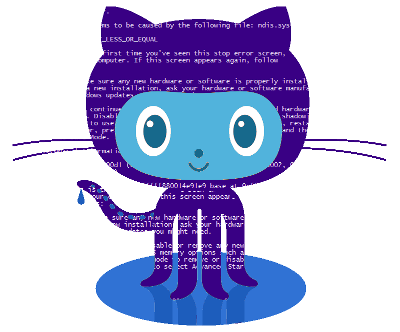

<h1 align="center">SafeSenora</h1>

  

 

SafeSenora is a cross platform app built on <a href="https://flutter.dev/docs">Flutter</a> from a single codebase.

SafeSenora means to Safe Women in case of doubtful or any emergency situation .

We BugHunters would like to say something: As we all know that Women safety is one of the major issues coming from the past, becuase all has the chance to live with freedom.

As Computer Science Students we have tried our best to make something for the society.
We believe in the Idea of Community concern i.e. helping one person might not change the whole world, but it could change the world for one person. Helping a person at the right time and at the correct place would be the best help that one can provide to anyone.

# Features to Scroll!
 
* [User Mannual](https://github.com/Pratiknarola/safesenora/blob/master/usermanual.md)
* [Access Requirements](https://github.com/Pratiknarola/safesenora/blob/master/README.md#L28)
* [functions](https://github.com/Pratiknarola/safesenora/blob/master/README.md#L39)
* [Technologies](https://github.com/Pratiknarola/safesenora/blob/master/README.md#L46)

## User Access Required
* location
* Contact list
* Media Access
* Phone Calls
* battery Usage

## Functions inside App

* Alert messages and notifications.
* Information about the member who requires help.
* Emergency Helpline numbers like Police (100) etc.

## Tech used:
* google maps API
* firebase firestore
* firebase storage
* firestore functions
* flutter framwork
* native android api
* firebase cloud messaging
* node js 
* platform channels
* Mobile Resources

### Installation

App is under Development. We will soon be releasing its beta version.
Download our App from playstore on release: SafeSenora

For more Reference :refer [User Mannual](https://github.com/Pratiknarola/safesenora/blob/master/usermanual.md)

### Development

Want to contribute? Great!
Develop Something to contribute with us on this project and become the part of our community.

If you want to contribute to a project and make it better, your help is very welcome. Contributing is also a great way to learn more about social coding on Github, new technologies and and their ecosystems and how to make constructive, helpful bug reports, feature requests and the noblest of all contributions: a good, clean pull request.
How to make a clean pull request
<a href="https://github.com/firstcontributions/first-contributions">Click Here to know more</a>

**Free Application, Hell Yeah!
Any Queries hit us here or on playstore. Since we will be releasing it shortly, We will try to resolve your issue shortly.**